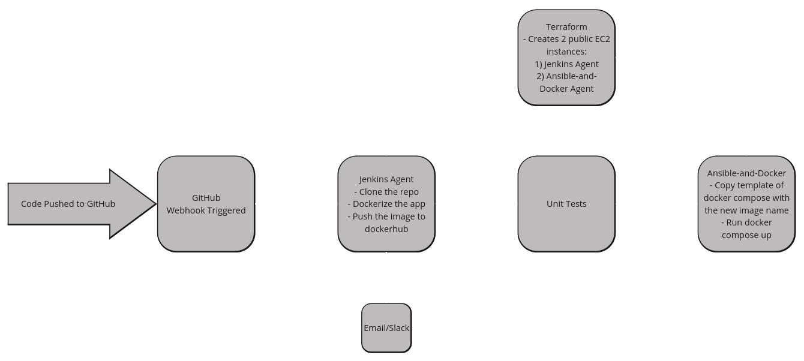

# Automated-Deployment-Pipeline-with-Jenkins-and-Docker

## Overview
This project demonstrates an end-to-end Continuous Integration/Continuous Deployment (CI/CD) pipeline using Jenkins, Docker, Ansible, and Terraform. The pipeline automates the process from code push to deployment, utilizing infrastructure as code (IAC) and containerization principles for consistent and automated deployments.

## Pipeline Steps Explanation

### Step 1: Code Push to GitHub

When the developer pushes code to the GitHub repository, a webhook is triggered, notifying Jenkins of the update. This initiates the pipeline process automatically.

### Step 2: Jenkins Pipeline Execution

Upon receiving the webhook, Jenkins:
1. **Clones the repository**: Jenkins pulls the latest code from GitHub.
2. **Dockerizes the application**: Jenkins uses a `Dockerfile` to package the application into a Docker image.
3. **Pushes the image to Docker Hub**: After the image is built, it is pushed to a Docker Hub repository for storage and future deployments.

### Step 3: Infrastructure Setup with Terraform

Terraform is used to provision two EC2 instances in AWS:
- **Jenkins Agent EC2**: Hosts the Jenkins agent that runs the pipeline.
- **Ansible and Docker Agent EC2**: Used to deploy the application.

Terraform scripts define and manage the infrastructure-as-code, ensuring reproducibility and consistency in environment setups.

### Step 4: Unit Testing

Jenkins runs unit tests to ensure that the new code does not break the application. If the unit tests pass, the deployment process proceeds. If they fail, Jenkins stops the process and notifies the team via email or Slack.

### Step 5: Deployment with Ansible and Docker

- **Docker Compose Template Update**: Ansible updates the Docker Compose file template, injecting the new Docker image name.
- **Deployment**: 
   - If there are changes in the image or configuration, Ansible triggers a handler that runs `docker-compose up` on the Ansible-and-Docker EC2 instance.
   - This deploys the latest version of the application.

### Step 6: Notifications

Throughout the pipeline, Jenkins is configured to send notifications about the pipeline status (successful build, failed tests, deployment status) via email.

---

